## Activity 1: Setup Paths with Pathplanner

### PART A: Setup Apps and Repo
- Clone [this](https://github.com/beranki/frc-drive-samples/tree/training/samples) repository. Make sure that it is replicated in a place that you can easily navigate to. (Why? When we get to setting up Pathplanner, you're going to have to navigate to this with your file explorer. Just a heads up.)
- Inside your WPILib VS Code interface, do the following: 
    - Open WPILib Command Palette (press the little WPILib logo in the top right) → WPILib: Manage Vendor Libraries → Install New Libraries (online) → “https://3015rangerrobotics.github.io/pathplannerlib/PathplannerLib.json”

- Follow [these](https://github.com/mjansen4857/pathplanner/releases) instructions to install the latest version of PathPlanner that complies with your OS.
- When you finish this, open up PathPlanner, and it should prompt you to **Open Robot Project**. 
    - *hint, this is the repo that you just cloned! now is the time to select it with your OS' file explorer.*

- It should then prompt you with a GUI that looks something like this.
    - 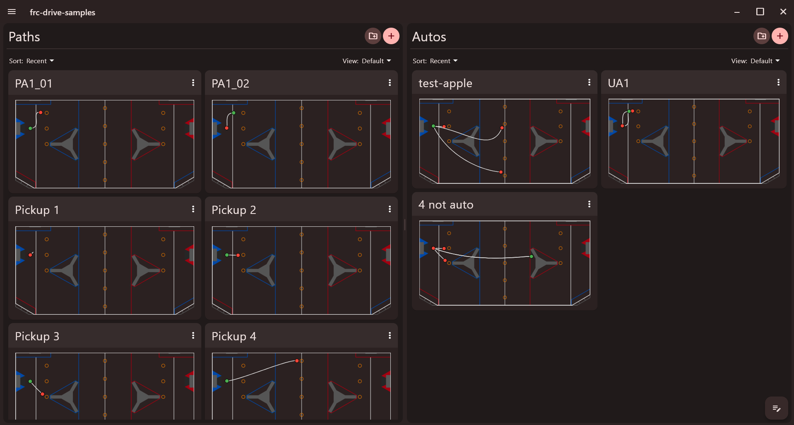
    - Yes, it should come with some preloaded paths. In this repository, we have added some paths for you to test with and ensure that things work before you start toying around. :)

- To make sure that you are able to access AdvantageScope and the Sim GUI, open the WPILib command palette and select "WPILib: Simulate Robot Code".
    - At this point, it should return **BUILD SUCCESSFUL** in the console and should then prompt you to select the Sim GUI and(or) the Driver Station. *Just select the Sim GUI for now*. It should look something like this (you might not have the same widget layouts, which is ok.):
    - 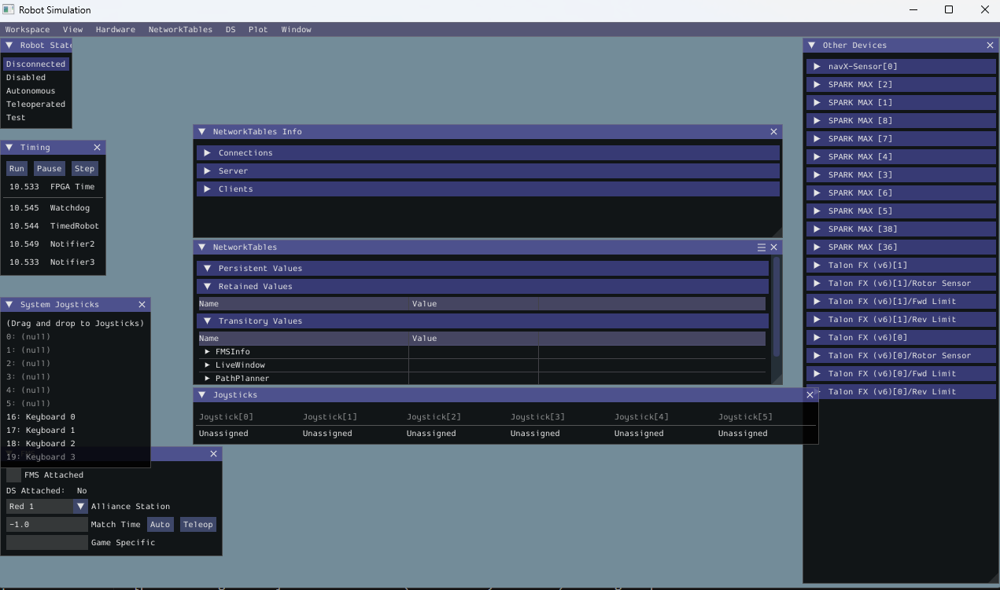
    - You should also make sure that you can access AdvantageScope. You can do this by opening the command tool, and selecting "WPILib: Start Tool". It will then prompt you with a list of options -- select AdvantageScope. When you first open it, it might look something like this:
    - 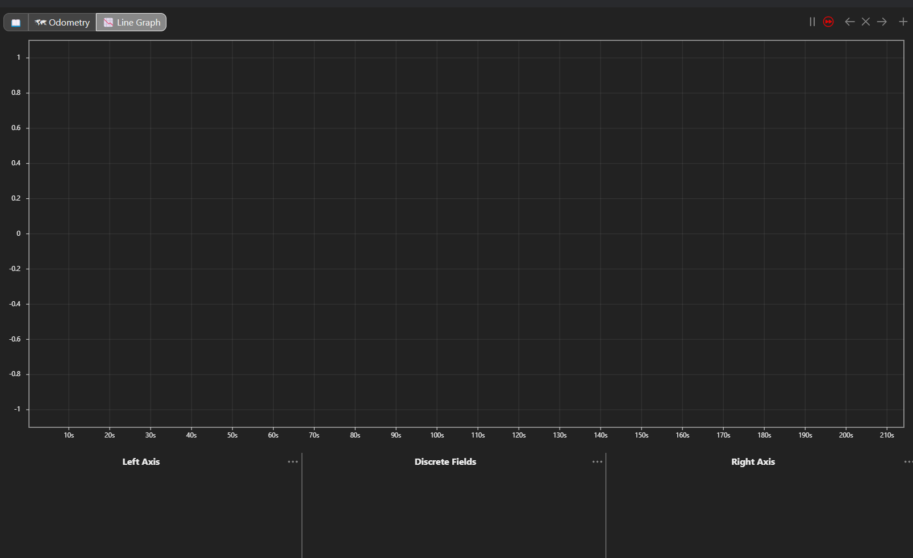

## PART B - Connecting to Simulator and Testing Prewritten Paths
- At this point, you have installed PathPlanner and opened the Sim GUI and AdvantageScope. We're now going to use all 3 to simulate some paths and visualize expected vs. actual trajectory. Let's start!
    - This repository contains code to help simulate the trajectory of the robot during autonomous with commands from PathPlanner. We're going to use AdvantageScope to help simulate and visualize the odometry.
- To do this, we're going to need to open AdvantageScope first with the Start Tool option. At first, it's going to tell you it's not connected to anything -- this is expected, as we do not have the simulation running yet. 
    - Then we're going to connect to the Sim GUI. Once we open it, we can now open AdvantageScope, go to File in the top left, and select "Connect to Simulator."
    - 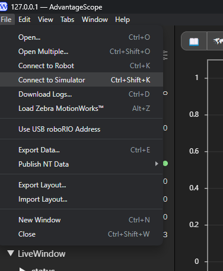
    - If you've connected, you'll notice that the side tab is going to populate with Shuffleboard and robot diagnostic data. (data might not be the same, but the idea is it'll show up -- indicating it's connected to the simulator now.)
    - 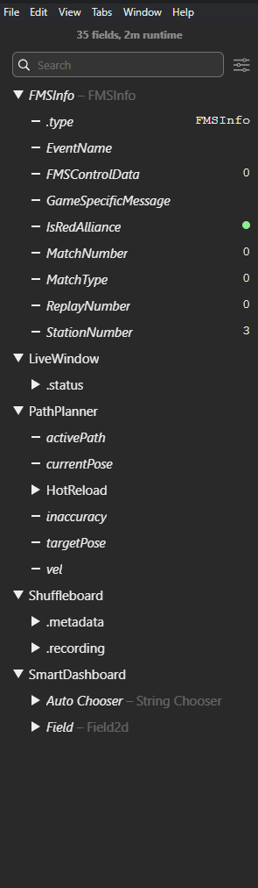
    - That line graph is also going to start moving as it logs real-time data. (PS: It will be empty for now.)
    - If you're wondering what it is connecting to, when you run the Sim GUI, it initiates a NetworkTables client, which AdvantageScope connects to as a "simulator."
- At this point, navigate to AdvantageScope and click on the plus button in the GUI, and select **Odometry**.
- 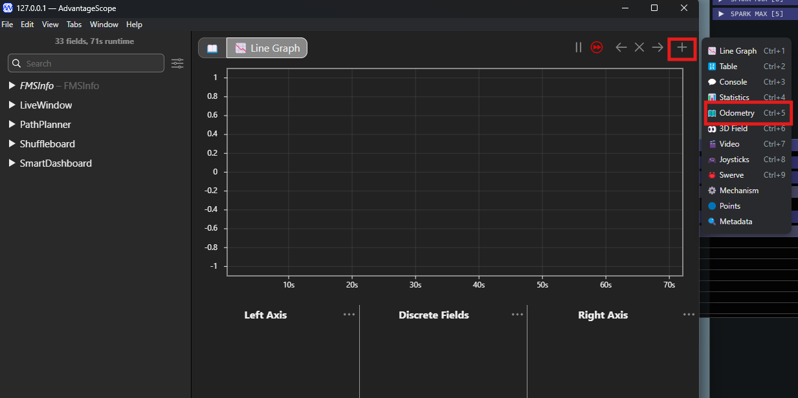

- At this point, you should see a empty 2D view of the map, with a table with columns labelled "Poses, Coordinate System, and Robot Config," with data on the left tab of the GUI.
    - Select the PathPlanner tab of the live data tab of the GUI and drag *activePath*, *currentPose*, and *targetPose* into the Poses section. It should look like this:
    - 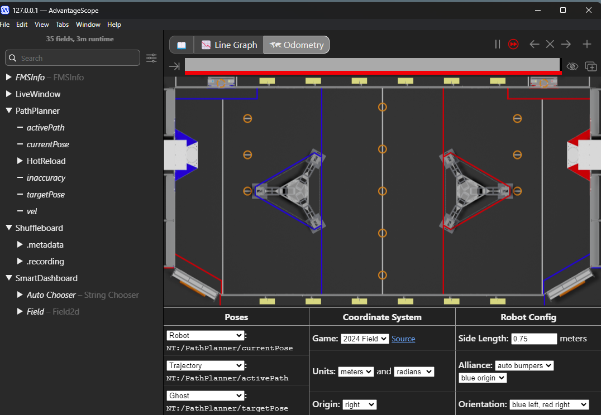

- Now we need to actually run the paths we have, right? To do this, go to your Sim GUI. The things you will need to control here are *The Robot State*, *Auto Chooser*, and *FMS*.
    - These tabs are meant to be filled with data that accurately reflects the path or orientation in which your robot is to run. For the sake of running you through the pipeline of testing Pathplanner w/ AdvantageScope, all 3 "autos" that we have made for you start in the orientation of **Blue 2**. Select that as the Alliance Station in the FMS. Since we're testing the Autonomous section, also select the "Auto" option for match time in the FMS.
    - For the robot state, we keep it at disconnected / disabled when we are configuring FMS info or what auto we want to run (select whichever of the 3 you want to run in the Auto Chooser widget.)
    - When you are ready to run your according auto, switch your robot state from disabled / disconnected to autonomous. It should run accordingly in the AdvantageScope simulation. Try it!
    - 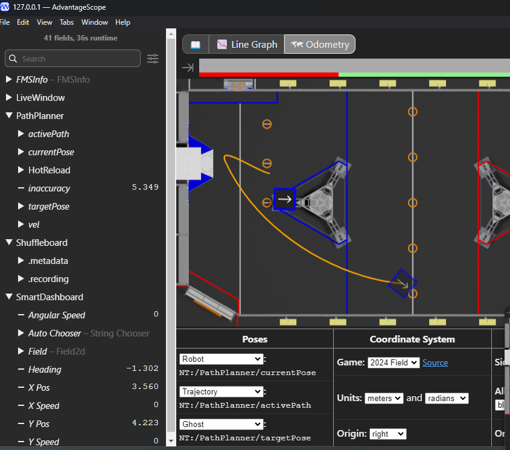

- Some notes after you run this -- the **currentPose** path tracked may be inaccurate from the trajectory and ghost mapped - this is ok for our demo purposes. It is an issue with the sim code that for time's sake, will remain unresolved. We'll try to patch this in the future. Help is invited. \:)

## PART C - Make and Simulate Your Own Paths!
- PathPlanner allows you to make paths easily with a GUI based system. We set up the simulator and PathPlanner in Parts A and B, and now it is time for you to make some paths of your own!
    - Open up the PathPlanner GUI and make sure it is tracked to this repository in your OS' file explorer. Refer to part A for more thorough instructions on how to check / track.
- You will make 2 autos in Part C. These will be short and explore most of the common functionalities that PathPlanner offers. (multiple paths, commands, etc.) To explore how to make paths and intersect them with auto files, refer to the [summer training slides](https://docs.google.com/presentation/d/1h8Q4wW0ESzOypM9k-sX1mkUu0m0fHyBbjaZ1WcP4NeE/edit?usp=sharing).
    - A few notes...
        - You can set the start and end paths by DRAGGING THE green (starting position) and red (ending position). You can specify more in the waypoints section of the path.
        - You can set event markers with commands by expanding the section in the path GUI and clicking " + Add New Marker".
            - It will then add a new event marker. It will prompt a parallel group in it. Cick the (+) sign and add a Named Command to add a command. If you want to add a series of commands, you would need to add command groups.

 

- The ***FIRST AUTO*** should consist of a path that simply moves the robot back and forth in a single line, starting at the **Blue 2** position.
    - A few hints if you need them for the path...
        - A way to achieve this is to set the start and end point as the same pose (x, y, heading), and add a WAYPOINT in the middle of the start and end point, positioned at the end of the robot's line movement.
            - You can do this by selecting the Waypoints tab in the PathPlanner GUI, going into the Start Point tab, and clicking New Waypoint After.
            - This will add a waypoint that you can manipulate by dragging on the sample field or also in the Waypoints tab.
        - You can watch your robot's movement in real time to check if you did the right thing or not!
        - It might look something like this:
            - 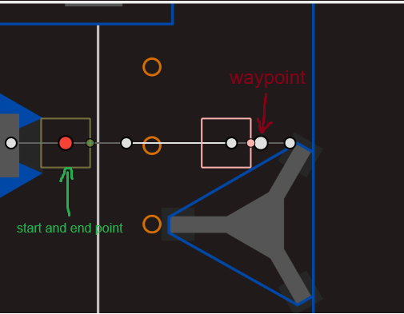
- After you make the path, make sure to add the path to a command group in the auto!
    - Also check that the starting pose of the auto is the same as the starting pose of the first path in the auto. This is typically the way to go.
    - I named the path *a-test* when I was testing the solution, so with this auto, it will look something like this:
        - 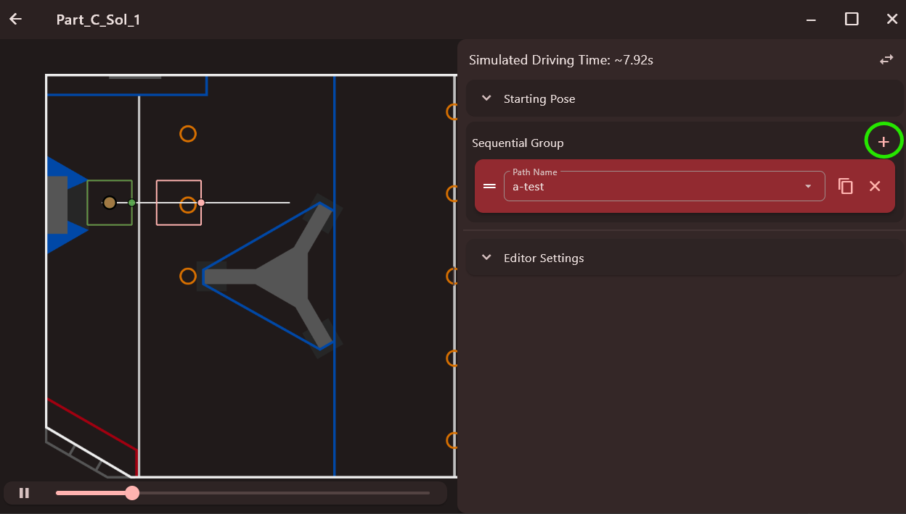
        - The green circled (+) button is used to add commands or paths. To add paths, you select *Follow Path.*
        - The driving time will be different based on the settings you specified in your path / the global settings. (lower max velocity --> more time, etc.)
- The ***SECOND AUTO*** you will make will consist of a path and a named command after it as a *sequential group* in the auto. It will mimic (on a smaller scale) an auto that may be used during our competitions. The starting position of this auto will be **Blue 2**. 
    - The first path will be a path that goes to the left most protected note in a loop, starting at the Blue 2 starting position, going to the left most protected note with a waypoint, and returning to the end point (which should have the same pose as the starting point).
    - However, this path will also have event markers!!
        - One of the markers will be near the start, and have the robot pivot the intake from the *shooter* to *ground* position - so, you can name this command *pivot_shooter_to_ground.* (it's up to you.)
            - This marker should ALSO have an intake command run AFTER the previous command has finished. How could we do this? 
                - Think making the event marker a Sequential Command Group and adding the two commands to the group!
        - The second marker should be after the note has been reached in the path, and should make the robot pivot the intake from the *ground* to *shooter* position - so you could name this *pivot_ground_to_shooter.* (again, up to you.)
    - If you make this path correctly, it might look something like this:
        - 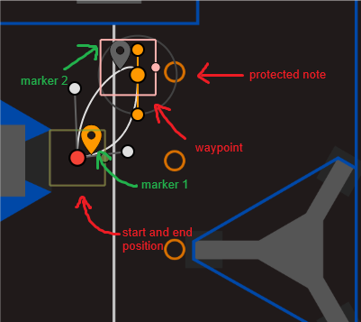
    - Add this path to a new auto's sequential group of commands. However, also add a named command after the Follow path command called *shoot*. This is meant to mimic the robot shooting the note it just picked up. 
        - Should look something like this (naming of paths and auto may be different):
        - 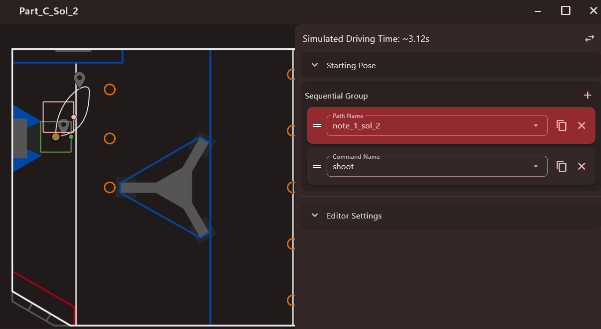

---

- If you were able to follow through all 3 parts of the training, you've completed the SW Drive Summer Training exercises! Thank you for your time and effort. We would love to answer any questions / adjust the training accordingly to any feedback. 